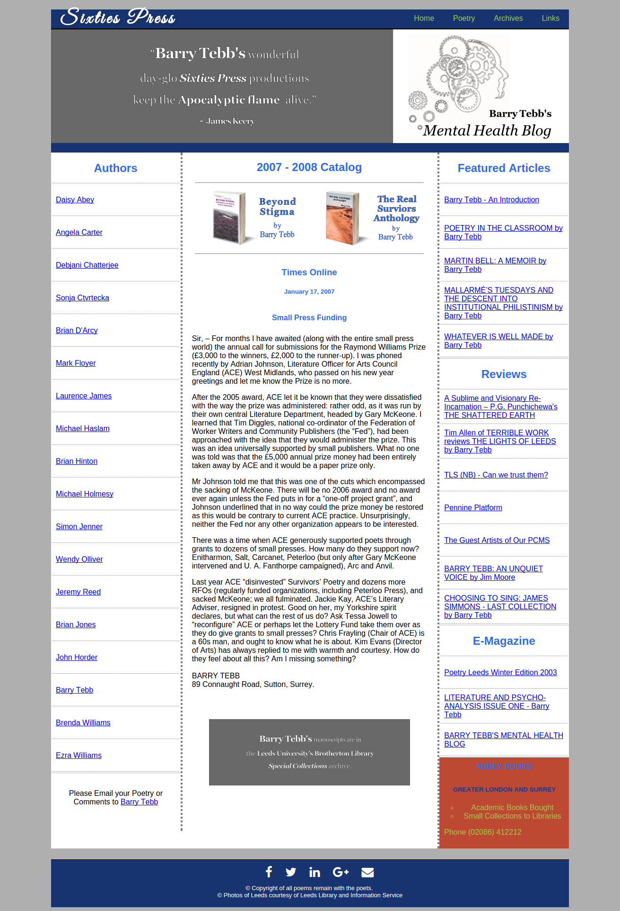
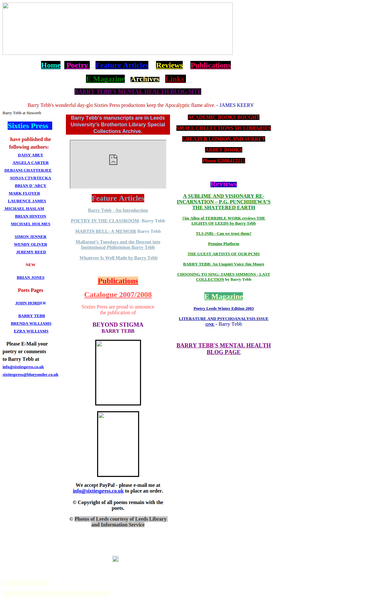
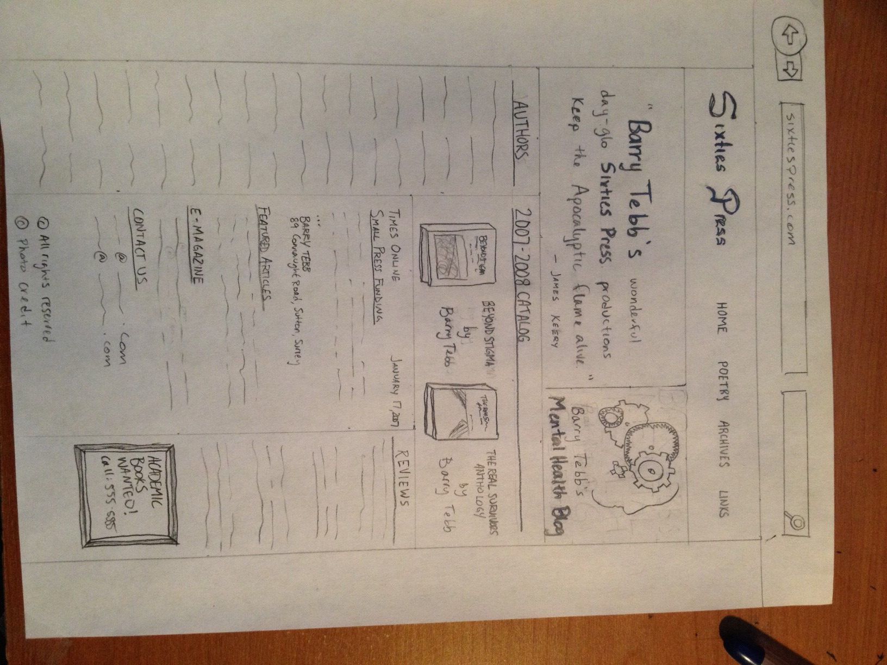
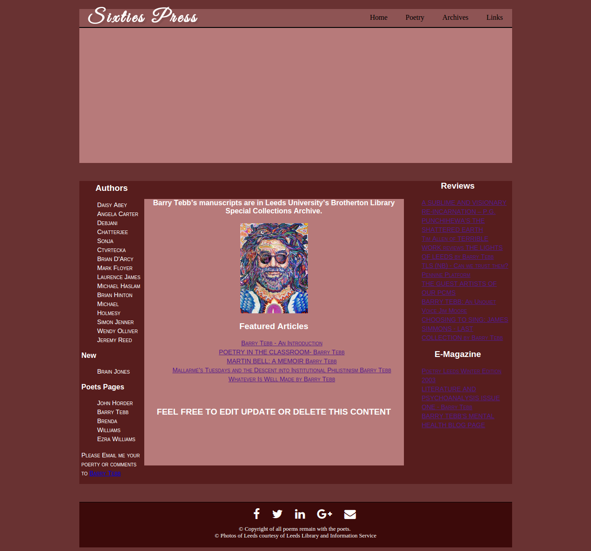

Client-Side Scripting: Team Project 1
==============

SixtiesPress.co.uk Redesign
--------------

*This project was an academic exercise in web design and teamwork.  Our task was to redesign the original sixtiespress.co.uk website, which was voted the 3rd worst website on the web by [the folks at webpagesthatsuck.com](http://www.webpagesthatsuck.com/worst-websites-of-2011.html) of 2011.*

**Contributors**
- James Boynton (Team Leader)
- Todd Brault
- Alex Castillo
- JP Stearns

The Final Product

The Original Design

The Design Process

