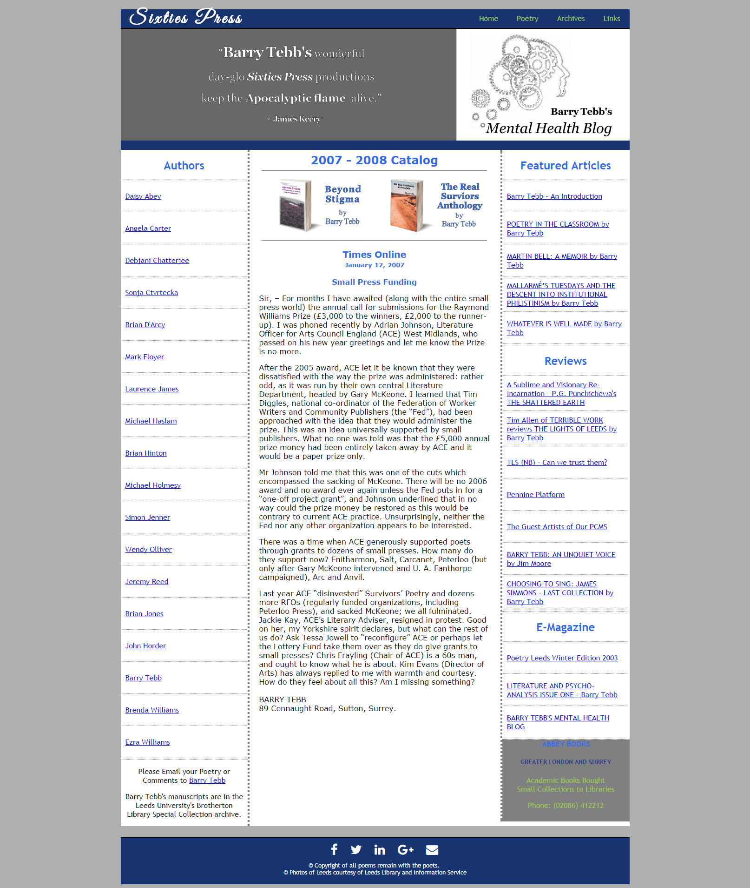
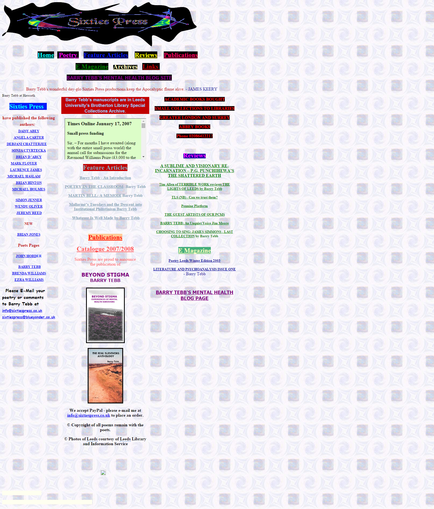
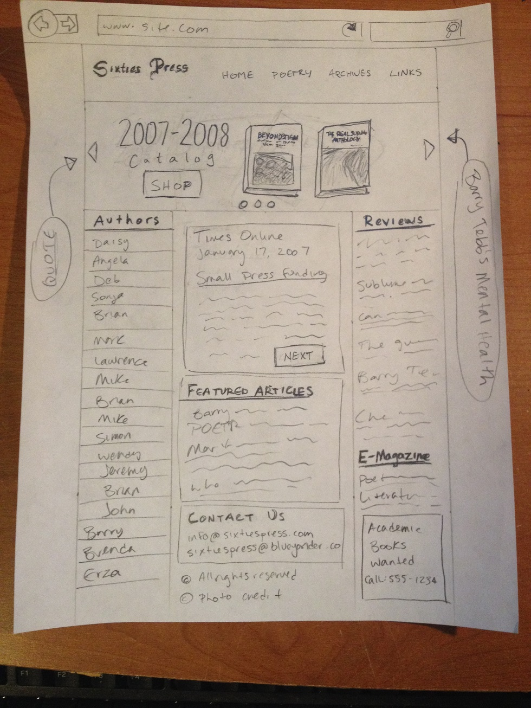
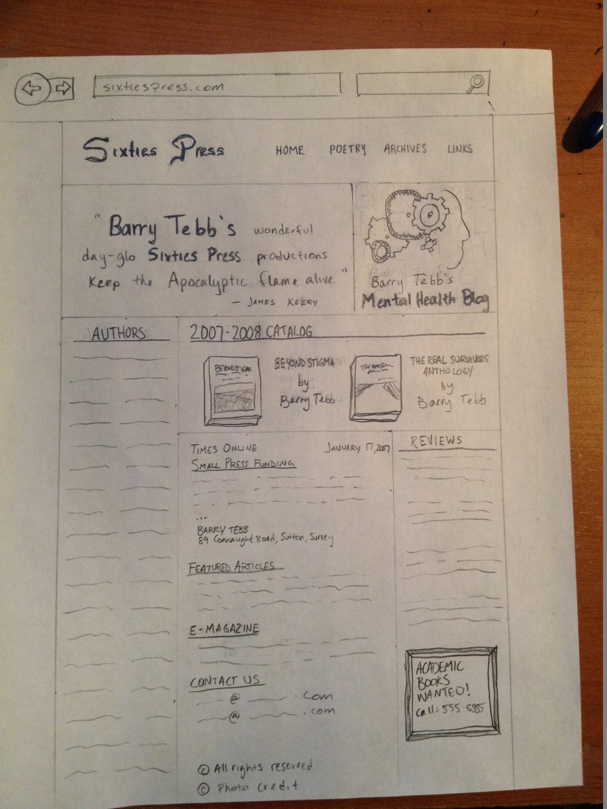
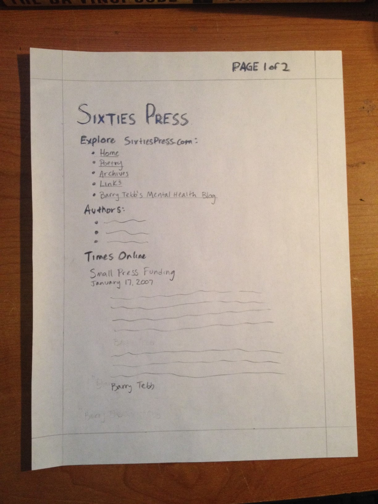

Client-Side Scripting
==============

Team Project 1: SixtiesPress.co.uk Redesign
--------------

*This project was an academic exercise in web design and teamwork.  Our task was to redesign the original sixtiespress.co.uk website, which was voted 2011's 3rd worst website on the web [by the folks at webpagesthatsuck.com](http://www.webpagesthatsuck.com/worst-websites-of-2011.html).*

**Contributors**
- James Boynton (Team Leader)
- Todd Brault
- Alex Castillo
- JP Stearns

**The Final Product**

**The Original Design**

**The Design Process**
*First Mock-up*

*Second Mock-up*

*Print Layout Mock-up*

